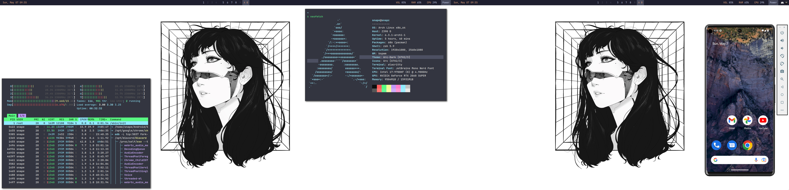
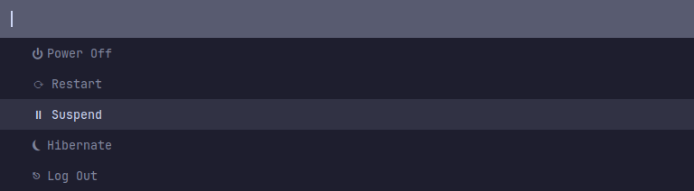
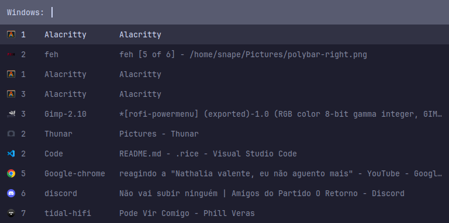
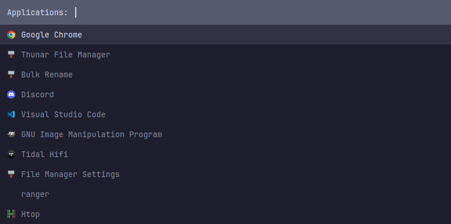

# Environment configs

## My Arch Setup

Entire Setup



Bar


Menus

- Power: <br/> 

- Running applications: <br/> 

- Open applications: <br/> 

## **Add-ons**

These are the configurations to programs I use to set up my system. The purpose of this repository is to centralize my configurations, making them easy to access, maintain, and reinstall.

| Funtionality | I'm using |
| - | - |
| Display Manager | SDDM |
| Window Manager | bspwm |
| Wallpaper | nitrogen |
| Compositor | Picom |
| Bar | Polybar |
| X11 | Xorg configs |
| PolicyKit | Polkit-Gnome |
| Terminal Emulator | Alacricitty |
| Menu | Rofi |

<br/>


## **Install**

To install add-ons run the command:

```
λ ./install
```

To install one add-on specifically run the command:

```
λ ./${path-add-on}/install.sh
```


## **Setup**

To setup add-ons and scripts run the command:

```
λ ./setup
```

To setup one add-on specifically run the command:

```
λ ./${path-add-on}/install.sh
```

## **Configuration**

***To change*** any spec of configuration ***uses the file in this repo*** instead of change in config folder directly

Maybe is necessary to ***run setup script*** after change something, cause some configs are done with copy instead of link, than is needed to copy again ***to apply the changes***.

## **Thanks**

This are some repos in what i based myself to get my configs:

- [Derek Taylor - Dotfiles](https://gitlab.com/dwt1/dotfiles)
- [Eric Murphy - Dotfiles](https://github.com/ericmurphyxyz/dotfiles)
